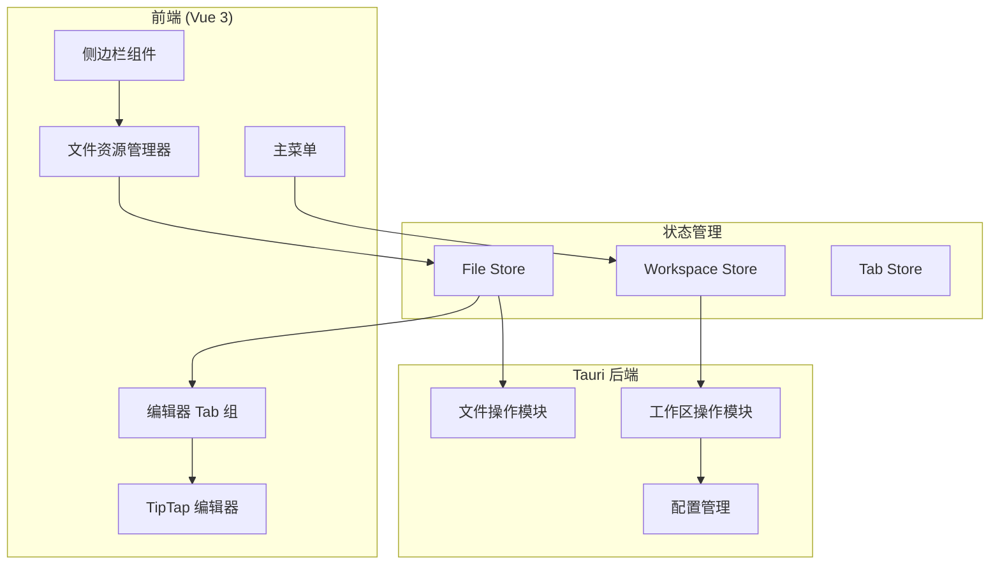
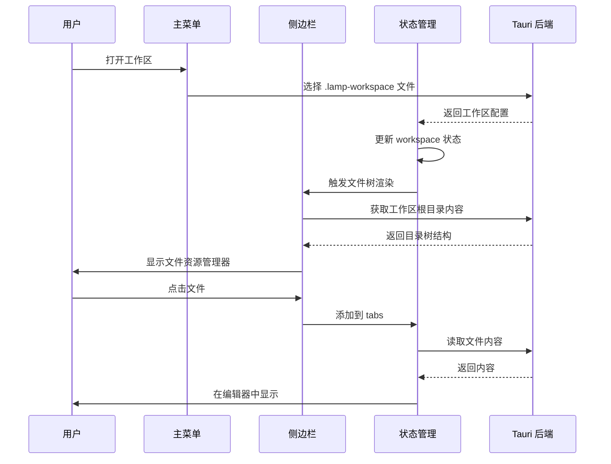

# LAMP 编辑器工作区架构设计方案

## 1. 项目背景与目标

### 1.1 现有架构分析

当前 LAMP 编辑器是一个基于 **Tauri 2.x + Vue 3 + TipTap** 的桌面文本编辑器，具备以下核心功能：

- 文件打开/保存/另存为
- 富文本编辑（基于 TipTap）
- AI 辅助功能（润色、扩写、续写、概述）
- 自动保存机制
- 左侧工具栏可显示文件夹目录结构

**现有交互模式**：

```
菜单栏 → 打开文件 → 在 Tab 中编辑 → 保存
工具栏按钮 → 切换显示/隐藏文件夹树 → 点击文件打开
```

### 1.2 用户需求

用户希望将 LAMP 改造为 **VSCode 风格**的编辑器，具体需求如下：

| 需求 | 描述 |
|------|------|
| 工作区概念 | 一个窗口对应一个工作区（类似 VSCode） |
| 固定侧边栏 | 打开工作区后，左侧固定展示工作区内的文件树 |
| 临时文件 | 工作区内也可以临时打开非工作区文件 |
| 纯临时模式 | 不打开任何工作区时，当作纯临时编辑器使用 |

---

## 2. 架构设计

### 2.1 核心概念

#### 2.1.1 工作区（Workspace）

工作区即一个**文件夹目录**，用于管理小说项目（如：一本书一个文件夹）。

无需配置文件，直接选择文件夹作为工作区即可。

- 工作区名称：文件夹名称
- 工作区根目录：选择的文件夹路径

#### 2.1.2 工作区类型

| 模式 | 描述 | 左侧面板 |
|------|------|----------|
| **工作区模式** | 已打开工作区 | 显示工作区文件树 + 临时文件区分 |
| **无工作区模式** | 纯临时编辑器 | 隐藏或显示"打开工作区"引导 |

#### 2.1.3 文件分类

| 类型 | 描述 | 标识 |
|------|------|------|
| 工作区文件 | 属于工作区根目录下的文件 | 无特殊标识 |
| 临时文件 | 非工作区目录下的文件 | 虚线文件夹图标或特殊颜色 |

### 2.2 系统架构图



### 2.3 数据流设计



---

## 3. UI/UX 设计

### 3.1 整体布局

```
┌─────────────────────────────────────────────────────────────┐
│  菜单栏 (文件 编辑 视图 设置)              [_] [□] [X]     │
├──────────┬──────────────────────────────────────────────────┤
│          │  Tab1  │  Tab2  │  Tab3  │                    │
│  文件    ├──────────────────────────────────────────────────┤
│  资源    │                                                  │
│  管理器  │              编辑器区域                           │
│          │                                                  │
│  - 文件1 │                                                  │
│  - 文件2 │                                                  │
│  - 文件3 │                                                  │
├──────────┴──────────────────────────────────────────────────┤
│  状态栏: 工作区名称 | 行:列 | 编码                           │
└─────────────────────────────────────────────────────────────┘
```

### 3.2 侧边栏设计

#### 工作区模式

```
┌文件资源管理器
│ ▼ 我的小说
│   ▼ 第一章
│     └ 第一节.md
│     └ 第二节.md
│   ▼ 第二章
│     └ 第一节.md
│   └ 序章.md
│   └ 终章.md
│ 
│ ▼ 临时打开
│   └ C:\temp\notes.txt  ─── 灰色标识
└────────────────────
```

#### 无工作区模式

```
┌文件资源管理器
│ 
│  当前未打开任何工作区
│  
│  [打开文件夹] 作为工作区
│  
│  或
│  
│  [打开文件] 作为临时编辑
└────────────────────
```

### 3.3 菜单栏变更

| 菜单项 | 功能 |
|--------|------|
| 文件 → 新建 | 新建临时文件 |
| 文件 → 打开文件 | 打开文件（临时） |
| 文件 → 打开工作区 | 选择文件夹作为工作区 |
| 文件 → 关闭工作区 | 退出工作区模式 |
| 文件 → 打开文件 | 临时打开文件 |
| 文件 → 最近打开 | 包含最近的工作区文件夹 |

---

## 4. 技术实现方案

### 4.1 前端结构变更

```
src/
├── components/
│   ├── Editor.vue          # 保留，编辑器组件
│   ├── MainMenu.vue        # 需修改，添加工作区菜单
│   ├── Sidebar.vue         # 新增，侧边栏容器
│   ├── FileExplorer.vue   # 新增，文件资源管理器
│   ├── WorkspaceTab.vue   # 新增，工作区文件树项
│   └── StatusBar.vue      # 新增，状态栏
├── stores/                 # 新增，Pinia 状态管理
│   ├── workspace.js       # 工作区状态
│   ├── files.js          # 文件树状态
│   └── tabs.js           # Tab 状态（现有逻辑迁移）
├── views/
│   ├── WorkspaceView.vue  # 工作区模式主视图
│   └── NoWorkspaceView.vue # 无工作区模式视图
└── App.vue                # 需修改，路由/模式切换
```

### 4.2 状态管理设计

#### 4.2.1 Workspace Store

```javascript
// stores/workspace.js
export const useWorkspaceStore = defineStore('workspace', {
  state: () => ({
    isOpen: false,           // 是否打开工作区
    workspacePath: '',       // .lamp-workspace 文件路径
    rootPath: '',            // 工作区根目录
    name: '',                // 工作区名称
    settings: {},            // 工作区设置
    recentWorkspaces: [],    // 最近工作区
  }),
  
  getters: {
    isWorkspaceMode: (state) => state.isOpen,
    workspaceFiles: (state) => state.files,
  },
  
  actions: {
    async openWorkspace(workspacePath) { /* ... */ },
    closeWorkspace() { /* ... */ },
    async addToWorkspace(filePath) { /* ... */ },
  }
});
```

#### 4.2.2 File Explorer Store

```javascript
// stores/files.js
export const useFileStore = defineStore('files', {
  state: () => ({
    tree: [],                // 文件树结构
    workspaceFiles: [],     // 工作区文件列表（用于区分）
    tempFiles: [],          // 临时打开的文件列表
  }),
  
  getters: {
    // 区分工作区文件和临时文件
    allFiles: (state) => [
      ...state.workspaceFiles.map(f => ({ ...f, isTemp: false })),
      ...state.tempFiles.map(f => ({ ...f, isTemp: true }))
    ]
  },
  
  actions: {
    async loadFolder(path) { /* ... */ },
    openFile(path) { /* ... */ },
    markAsTemp(filePath) { /* ... */ },
  }
});
```

### 4.3 后端 API 扩展

#### 4.3.1 新增 Rust 命令

```rust
// 工作区操作
#[tauri::command]
async fn open_workspace(path: String) -> Result<WorkspaceConfig, String>;

#[tauri::command]
async fn save_workspace(config: WorkspaceConfig) -> Result<(), String>;

#[tauri::command]
async fn get_recent_workspaces() -> Result<Vec<RecentWorkspace>, String>;

// 文件操作增强
#[tauri::command]
async fn is_file_in_directory(filePath: String, dirPath: String) -> Result<bool, String>;
```

### 4.4 菜单栏改造

需要在 `MainMenu.vue` 中添加以下菜单项：

```vue
<template>
  <el-menu>
    <el-sub-menu index="file">
      <template #title>文件</template>
      <el-menu-item @click="newFile">新建</el-menu-item>
      <el-menu-item @click="openFile">打开文件...</el-menu-item>
      <!-- 新增工作区相关 -->
      <el-menu-item @click="openWorkspace">打开工作区...</el-menu-item>
      <el-menu-item @click="addToWorkspace" v-if="workspaceStore.isOpen">
        将文件添加到工作区
      </el-menu-item>
      <el-menu-item @click="closeWorkspace" v-if="workspaceStore.isOpen">
        关闭工作区
      </el-menu-item>
      <el-divider />
      <el-menu-item @click="saveFile">保存</el-menu-item>
      <el-menu-item @click="saveFileAs">另存为...</el-menu-item>
    </el-sub-menu>
  </el-menu>
</template>
```

---

## 5. 实现计划

### Phase 1: 核心架构搭建

| 序号 | 任务 | 描述 |
|------|------|------|
| 1.1 | 创建 Pinia Store | 创建 workspace 和 files 状态管理 |
| 1.2 | 改造 App.vue | 实现工作区/无工作区模式切换 |
| 1.3 | 创建 Sidebar 组件 | 左侧文件资源管理器容器 |
| 1.4 | 创建 FileExplorer | 文件树展示组件 |

### Phase 2: 工作区功能

| 序号 | 任务 | 描述 |
|------|------|------|
| 2.1 | 后端 API | 添加工作区相关 Rust 命令 |
| 2.2 | 打开工作区 | 实现 .lamp-workspace 解析和加载 |
| 2.3 | 关闭工作区 | 实现工作区退出逻辑 |
| 2.4 | 菜单改造 | 添加工作区相关菜单项 |

### Phase 3: 文件管理增强

| 序号 | 任务 | 描述 |
|------|------|------|
| 3.1 | 文件树优化 | 支持展开/折叠、图标显示 |
| 3.2 | 临时文件标识 | 区分工作区文件和临时文件 |
| 3.3 | 右键菜单 | 添加文件操作菜单 |
| 3.4 | 文件监视 | 监听外部文件变化 |

### Phase 4: 用户体验优化

| 序号 | 任务 | 描述 |
|------|------|------|
| 4.1 | 状态栏 | 显示工作区名称、文件信息 |
| 4.2 | 最近文件 | 记录最近打开的工作区和文件 |
| 4.3 | 欢迎页面 | 无工作区时的引导界面 |
| 4.4 | 拖拽支持 | 支持拖拽文件到编辑器 |

---

## 6. 非功能性考虑

### 6.1 性能

- **大目录加载**: 首次加载工作区时采用懒加载，仅展开第一级目录
- **文件树虚拟化**: 目录层级过深时使用虚拟滚动
- **自动保存**: 保留现有自动保存机制

### 6.2 安全

- **工作区文件验证**: 解析 .lamp-workspace 时验证路径合法性
- **权限控制**: 使用 Tauri 2.x 权限系统控制文件系统访问

### 6.3 兼容性

- **版本迁移**: 设计工作区配置版本机制，支持未来升级
- **路径处理**: 统一使用 path 模块处理跨平台路径

---

## 7. 总结

本方案将 LAMP 从单一的"打开文件-编辑-保存"模式，改造为支持工作区的编辑器。核心变更点：

1. **工作区即文件夹** - 直接选择文件夹作为工作区，无需配置文件
2. **左侧文件资源管理器** - 展示工作区文件夹结构（适合小说章节管理）
3. **临时文件支持** - 工作区内也可临时打开其他文件
4. **渐进式设计** - 支持纯临时编辑器模式，无需强制打开工作区

此架构保持了现有编辑功能（TipTap、AI 辅助）的完整性，同时提供了更现代的文件管理体验，特别适合小说作者管理书籍章节。
